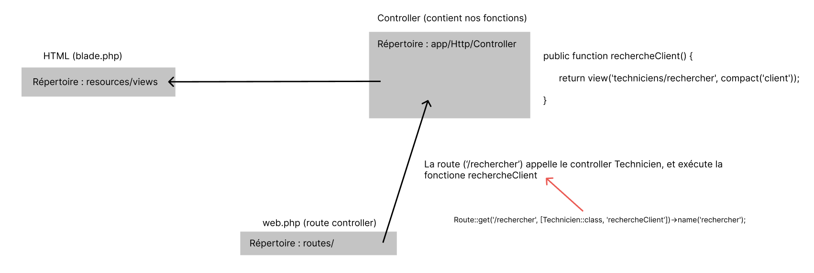

## Contexte
La société CASHCASH possède 57 agences sur le territoire national. On comprend bien que le nombre d’interventions à gérer sera très important. De plus, chaque client étant rattaché à une agence, la société CASHCASH privilégie la proximité lors des déplacements. Par ailleurs, la réactivité de la société CASHCASH est essentielle pour assurer la confiance qui la lie à ses clients. Son système d’information doit donc pouvoir gérer un maximum d’informations sur les interventions. Une application web a été choisie puisqu’elle permet de s’adapter à l’hétérogénéité des solutions techniques d'accès (STA) des salariés.
Cela peut être aussi bien des smartphones, des PC plus ou moins performants, des tablettes. Enfin, ces STA fonctionnent sur des systèmes d’exploitation différents (Windows, Linux, Androïd…).

## Application
VDEV fournit des solutions adaptative (responsive).

Par ailleurs, VDEV améliore sans cesse l’ergonomie et l’attractivité des solutions web. Vous devez faciliter les saisies avec par exemple des champs auto complétés. Enfin,vous devez utiliser des contrôles graphiques modernes comme les DatePicker. Fort de leur expérience dans le développement, les responsables de VDEV vous suggèrent d’utiliser les technologies suivantes : Javascript, Ajax, JQuery.

VDEV souhaite retrouver les spécifications et contraintes techniques suivantes :
- Une règle de nommage des variables
- Un diagramme de cas d’utilisation
- Une description textuelle des cas d’utilisation
- Un maquettage des IHM (les composants doivent être nommés)
- Le choix des Architecture logicielles retenues
- Une Charte graphique
- La compatibilité avec différents navigateurs.
- La visualisation correcte des informations sur terminaux mobiles
- Rapport de tests
- Un code commenté
VDEV souhaiterait développer idéalement ses solutions web sur un modèle MVC
(Modèle-Vue-Contrôleur) avec les nouvelles recommandations en matière de séparation des couches (HTML, CSS, JavaScript).

## Contraintes à respecter
- Les gestionnaires et les techniciens doivent pouvoir se connecter à leurs espaces avec un mot de passe sécurisé.
- Une fois connecté le gestionnaire peut affecter des visites à un technicien et visualiser les informations grâce à un outil.
- Le technicien après s’être connecté peut rechercher une fiche client avec le numéro client et visualiser ou modifier la fiche.
- Le technicien peut générer une fiche d'intervention au format PDF.
- Le technicien doit pouvoir consulter les interventions par date ou par agent et par la suite éditer la fiche intervention.
- Les techniciens peuvent consulter les interventions qui leur sont affectées et les valider avec un commentaire et le temps passé.

## Structure de l'application
Les pages HTML du projet se trouve dans `resources/views`, tous les fichiers sont au format `.blade.php`

Le fichier s'occupant de la gestion des routes du projet se trouve dans `routes/web.php`. C'est notre "Route Controller"

L'ensembles de nos fonctions sont stockés dans nos contrôleurs, situés dans `app/Http/Controllers`.

Exemple d'une route : 
```php
Route::get('/[url-personnalisé]', [[Nom-du-controlleur]::class, '[nom-de-la-fonction-appelée]'])->name('rechercher');

// ->name('') permet de définir un nom pour la route
// pour l'appeler plus facilement
->name('rechercher');
```


